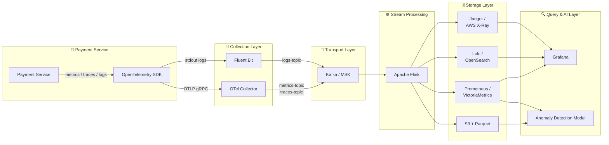

# W1-D3 Submission — Data Layer Architecture + Observability Pipeline

**Assignment**: Week 1, Day 3 — Data Layer Architecture + Observability Pipeline
**Author**: Platform Engineering Trainee
**Date**: 2025-06-03

---

## 1. Mock Streaming Pipeline

### What `pipeline.py` does

`pipeline.py` simulates a **streaming observability pipeline** using Python's `queue.Queue` as an in-process message bus:

1. **Download** — Auto-downloads the NAB `machine_temperature_system_failure.csv` dataset if not present (22,695 rows, 5-minute intervals from 2013-12-02 to 2014-03-31).
2. **Producer** — Reads each CSV row and pushes a `{"timestamp": ..., "value": float}` event into the queue.
3. **Consumer** — Reads events from the queue and computes 9 streaming features using rolling windows and lag operations.
4. **Output** — Saves features to `results/features.parquet` (falls back to `results/features.json` if pyarrow is unavailable).

### Features Computed

| Feature | Description |
|---|---|
| `rolling_mean_1h` | Rolling mean of last 12 points (12 × 5 min = 1h) |
| `rolling_std_1h` | Rolling std of last 12 points |
| `rolling_mean_4h` | Rolling mean of last 48 points (48 × 5 min = 4h) |
| `rate_of_change` | current − previous value |
| `lag_1` | Value from 1 step ago (5 min ago) |
| `lag_12` | Value from 12 steps ago (1h ago) |
| `hour` | Hour of day (0–23) |
| `day_of_week` | Day of week (0=Monday … 6=Sunday) |

### Output File

```
results/features.parquet   (22,695 rows × 10 columns)
```

### Sample Output (first 5 rows)

```
timestamp              value     rolling_mean_1h  rolling_std_1h  rolling_mean_4h  rate_of_change  lag_1     lag_12  hour  day_of_week
2013-12-02 21:15:00    73.9673   73.9673          None            73.9673          None            None      None    21    0
2013-12-02 21:20:00    74.9359   74.4516          0.6849          74.4516          0.9686          73.9673   None    21    0
2013-12-02 21:25:00    76.1242   75.0091          1.0803          75.0091          1.1883          74.9359   None    21    0
2013-12-02 21:30:00    78.1407   75.7920          1.7971          75.7920          2.0165          76.1242   None    21    0
2013-12-02 21:35:00    79.3298   76.4996          2.2194          76.4996          1.1891          78.1407   None    21    0
```

### Run

```bash
python pipeline.py
```

---

## 2. Architecture Diagram

See [`architecture.md`](architecture.md) for the full document.

### Summary Diagram



---

## 3. Cost Estimate

See [`results/cost_estimate.md`](results/cost_estimate.md) for the full breakdown.

### Monthly Cost Table (USD)

| Tier   | Metric Storage | Log Hot | Log Cold | Trace Storage | Kafka | Flink | Network | **Build Total** | **Datadog SaaS** |
|--------|---------------|---------|----------|---------------|-------|-------|---------|-----------------|------------------|
| Small  | $777.60 | $525.00 | $34.50 | $120.00 | $294.99 | $108.00 | $27.00 | **$1,887.09** | **$7,548.36** |
| Medium | $7,776.00 | $5,250.00 | $345.00 | $1,200.00 | $2,949.91 | $324.00 | $270.00 | **$18,114.91** | **$54,344.74** |
| Large  | $77,760.00 | $52,500.00 | $3,450.00 | $12,000.00 | $29,499.12 | $3,240.00 | $2,700.00 | **$181,149.12** | **$452,872.80** |

### Build vs Buy Summary

| Tier   | Build/Month | Datadog SaaS/Month | Savings with Build |
|--------|-------------|--------------------|--------------------|
| Small  | $1,887.09   | $7,548.36          | $5,661.27 |
| Medium | $18,114.91  | $54,344.74         | $36,229.83 |
| Large  | $181,149.12 | $452,872.80        | $271,723.68 |

**Key insight**: At Large scale, building your own stack saves **$271K/month (~$3.2M/year)** compared to Datadog SaaS.

---

## 4. ADR Summary

See [`ADR-001.md`](ADR-001.md) for the full decision record.

### Decision: Use Kafka for Observability Transport

**Status**: Accepted

**Core trade-off**:

| Dimension | Direct Push | Kafka |
|---|---|---|
| Latency | <50 ms end-to-end | +5–20 ms added |
| Data loss risk | High (if storage down) | None (7-day replay) |
| Fan-out | Multiple HTTP calls | Single topic, N consumers |
| Backpressure | Service OOM risk | Absorbed by Kafka |
| Cost (Medium) | Lower | +$2,000–3,000/month |
| Operational complexity | Low | Medium–High |

**Verdict**: For a payment service where **reliability and replay outweigh minor latency differences**, Kafka is the correct choice. The 5–20 ms added latency is negligible for observability signals (not in the payment transaction path), while the 7-day replay capability is essential for incident post-mortems.

---

## 5. Reflection

**Câu hỏi**: Nếu được hire làm Platform Engineer cho startup 50-service vừa raise Series A, recommend build hay buy? Tại sao?

**Recommendation: Hybrid — Buy now, build gradually**

Với startup 50 service vừa raise Series A, tôi sẽ recommend **hybrid approach — ưu tiên buy trước, build dần về sau**. Cụ thể:

**Giai đoạn 1 (Tháng 1–3): Buy SaaS**
- Dùng **Datadog** hoặc **New Relic** ngay lập tức — có dashboard, alert, APM trong vòng 1–2 tuần mà không cần ops overhead.
- Lý do: Team startup thường nhỏ (2–5 engineers), chưa nên tự vận hành full stack Kafka + Flink + Prometheus + Loki + Jaeger. Đây là "undifferentiated heavy lifting" — không tạo ra product value cho khách hàng.
- Series A investor muốn thấy **product velocity**, không phải infra complexity.

**Giai đoạn 2 (Tháng 4–12): Hybrid — tối ưu chi phí log**
- Log là khoản tốn kém nhất trong Datadog (charge theo GB ingested). Khi log volume tăng (~500 GB/day ở medium tier), bill Datadog tăng rất nhanh.
- Giải pháp: Dùng **S3 + Parquet + Loki self-hosted** cho long-term log archive, chỉ giữ Datadog cho real-time alert và dashboard. Tiết kiệm được 40–60% log cost.
- Metric và trace vẫn để Datadog (tiện APM, service map, anomaly detection tích hợp sẵn).

**Giai đoạn 3 (Năm 2+): Build Internal Platform dần**
- Khi scale > 200 services hoặc khi Datadog bill vượt $50K/month, mới nên xem xét build internal observability platform với Kafka + Flink + VictoriaMetrics + Loki + Grafana.
- Lúc đó team đã đủ lớn (Platform team riêng), infrastructure knowledge đã có, và ROI của build rõ ràng.

**Tóm tắt ngắn gọn**: *"Buy fast to ship fast. Hybrid để tối ưu cost. Build khi scale đủ lớn để justify."* Đừng build Kafka trước khi có khách hàng.

---

## File Checklist

- [x] `pipeline.py` — Mock streaming pipeline
- [x] `cost_model.py` — Cost estimation model
- [x] `architecture.md` — Architecture diagram + documentation
- [x] `ADR-001.md` — Architecture Decision Record
- [x] `SUBMIT.md` — This submission document
- [x] `data/machine_temperature_system_failure.csv` — NAB dataset (22,695 rows)
- [x] `results/features.parquet` — Pipeline output (22,695 × 10)
- [x] `results/cost_estimate.csv` — Cost table (CSV)
- [x] `results/cost_estimate.md` — Cost table (Markdown)
