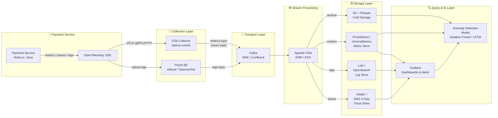

# Architecture: AIOps Anomaly Detection for Payment Service

## Overview

This document describes the end-to-end observability architecture for detecting anomalies in a **Payment Service** using a modern, cloud-native AIOps stack. The pipeline spans signal collection, transport, real-time processing, multi-tier storage, and ML-powered anomaly detection.

---

## Architecture Diagram



---

## Component Descriptions

| Component | Role | Technology Choice |
|---|---|---|
| **Payment Service** | Source of all telemetry signals | Node.js / Java microservice |
| **OTel SDK** | Instrument the service to emit metrics, traces, and structured logs | OpenTelemetry SDK (auto-instrumentation) |
| **OTel Collector** | Aggregate, filter, and batch telemetry before forwarding | `otelcol-contrib` — supports OTLP, Prometheus scrape, Kafka exporter |
| **Fluent Bit** | Lightweight log shipper running as a DaemonSet sidecar | Low memory footprint (~1 MB), excellent Kafka output plugin |
| **Kafka** | Durable message bus decoupling producers from consumers | Topics: `metrics`, `logs`, `traces`; replication factor 3 |
| **Apache Flink** | Stateful stream processing — windowed aggregations & enrichment | Exactly-once semantics, native Kafka connector |
| **Prometheus / VictoriaMetrics** | Time-series metric storage with scrape + remote write | VictoriaMetrics preferred at scale (lower memory, longer retention) |
| **Loki / OpenSearch** | Log storage — Loki for cost-efficient label indexing; OpenSearch for full-text search | Loki + S3 backend for long-term retention |
| **Jaeger / AWS X-Ray** | Distributed trace storage and UI | Jaeger with Elasticsearch backend; X-Ray for AWS-native deployments |
| **S3 + Parquet** | Immutable cold storage for all signals at low cost | Lifecycle rules auto-archive logs older than 7 days |
| **Grafana** | Unified observability dashboards, alerts, and SLO tracking | Connects to Prometheus, Loki, Jaeger via data source plugins |
| **Anomaly Detection Model** | ML model flagging unusual patterns | Isolation Forest for univariate metrics; LSTM for multivariate sequences |

---

## Why Kafka Instead of Direct Push?

Direct push (Service → Storage) might seem simpler, but for a payment system at scale, **Kafka is the right architectural choice**:

### Benefits

| Benefit | Details |
|---|---|
| **Replay capability** | If Prometheus goes down, Kafka retains messages for 7 days. After recovery, Flink can replay and backfill — no data loss. |
| **Decoupled producers/consumers** | Payment Service doesn't know or care about downstream storage. Adding a new consumer (e.g., ML pipeline, archival) requires zero changes to the service. |
| **Backpressure handling** | If OpenSearch is slow (e.g., during an index rebuild), Kafka absorbs the spike. Direct push would cause retries / OOM in the service. |
| **Fan-out** | Multiple consumers read the same topic: `storage`, `ml-pipeline`, `archive`, `alerting`. Direct push requires separate network calls for each. |

### Trade-offs

| Trade-off | Impact |
|---|---|
| **Added latency** | Kafka adds ~5–20 ms to end-to-end signal delivery (producer ack + consumer poll). |
| **Operational overhead** | Kafka cluster management: broker sizing, partition tuning, consumer lag monitoring, security (mTLS, ACLs). |
| **Cost** | Medium tier: ~$2,000–$3,000/month for MSK with 3 brokers, 1 TB storage, multi-AZ. |

**Verdict**: For a payment service where **reliability and auditability outweigh single-digit millisecond latency differences**, Kafka is the preferred transport. The ability to replay 7 days of telemetry data alone justifies the operational cost.

---

## Debug Flow: Metric → Trace → Log

When an anomaly alert fires, the investigation follows a structured 3-step path:

```
1. METRIC ANOMALY DETECTED
   Grafana fires alert: "Payment API p99 latency > 2s for 5 min"
   → Identify affected time window and service instance

2. TRACE — FIND THE SLOW SERVICE
   Jump to Jaeger/X-Ray: filter traces in the anomaly window
   → Find slow spans: DB query taking 1.8s (normally 50ms)
   → Narrow to: payments-db read replica lagging

3. LOG — FIND ROOT CAUSE
   Query Loki: filter logs for payments-db in that window
   → Found: "Replica lag: 45s — waiting for WAL apply"
   → Root cause: PostgreSQL replica fell behind due to vacuum ANALYZE
```

This **Metrics → Traces → Logs** correlation is the core debug loop enabled by the unified Grafana dashboard.

---

## Data Flow Summary

```
Payment Service
  │
  ├─[OTLP]──► OTel Collector ──► Kafka (metrics-topic, traces-topic)
  │                                     │
  └─[stdout]─► Fluent Bit ─────► Kafka (logs-topic)
                                        │
                              Apache Flink (enrichment, windowing)
                                 │        │        │        │
                              Prometheus  Loki   Jaeger    S3
                                 └────────┴────────┘        │
                                       Grafana           ML Model
                                  (dashboards, alerts)  (anomaly detection)
```
