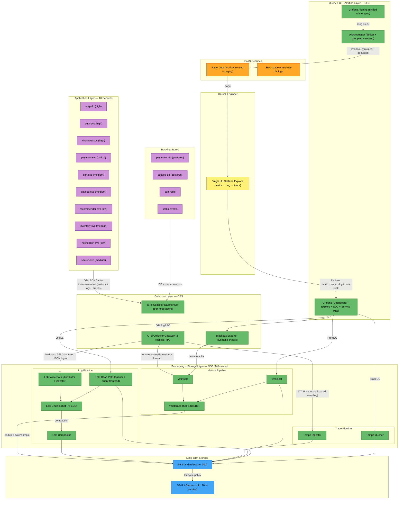

# A1 — Kiến Trúc Đích (Target-State Architecture)

## 1. Tổng quan Thiết kế

Kiến trúc đích chuyển từ **3 SaaS vendor phân mảnh** (Datadog + Splunk + PagerDuty + Grafana Cloud) sang mô hình **Hybrid: OSS self-hosted core + SaaS cho incident routing**, sử dụng Grafana Stack (LGTM) làm nền tảng chính và OpenTelemetry làm lớp collection vendor-neutral.

**Nguyên tắc thiết kế:**
1. **Single-pane-of-glass**: Một Grafana UI duy nhất thay vì 4 UI → giảm MTTR.
2. **Vendor-neutral ingest**: OTel Collector giữa service và backend → giảm vendor lock-in.
3. **Tiered retention**: Hot/Warm/Cold storage → giảm chi phí lưu trữ log 85%.
4. **Consolidate signals**: Metric ↔ Log ↔ Trace correlation trong cùng 1 UI → giảm MTTD.

---

## 2. Sơ đồ Kiến trúc Đích (Mermaid)

---

## 3. Phân loại Component theo SaaS / OSS / In-house

| Component | Loại | Lý do |
|---|---|---|
| OpenTelemetry Collector (DaemonSet + Gateway) | **OSS** | Vendor-neutral, CNCF graduated, thay thế Datadog Agent + Splunk Forwarder |
| VictoriaMetrics Cluster | **OSS** | Thay thế Datadog Infra Metrics, không cardinality penalty, tương thích PromQL |
| Grafana Loki | **OSS** | Thay thế Splunk Cloud + Datadog Logs, index-free → chi phí thấp hơn 10x |
| Grafana Tempo | **OSS** | Thay thế Datadog APM traces, object-storage native, chi phí thấp |
| Grafana | **OSS** | Thay thế Datadog UI + Splunk UI + Grafana Cloud, single-pane-of-glass |
| Grafana Alerting + Alertmanager | **OSS** | Thay thế Datadog Monitors + Splunk Alerts, fingerprint grouping giải quyết pain point #5 |
| Blackbox Exporter | **OSS** | Thay thế Datadog Synthetics ($1,360/tháng) |
| PagerDuty | **SaaS** | Giữ lại cho incident routing/paging, giảm user count |
| Statuspage | **SaaS** | Giữ nguyên, chi phí thấp ($290), không có OSS tương đương tốt |
| S3 / Object Storage | **Cloud IaaS** | Tiered retention: hot → warm → cold, lifecycle policy tự động |

---

## 4. Tại sao Kiến trúc này Giảm Chi phí

### 4.1 Giảm chi phí Log (~$15,700 → ~$750)
- **Trước**: Splunk Cloud ($13,900) indexing 52 GB/day + Datadog Logs ($1,800) = $15,700/tháng.
- **Sau**: Loki **không index nội dung log** — chỉ index labels (service, level, pod). Dữ liệu log lưu dạng compressed chunks trên S3. Chi phí S3 cho 52 GB/day × 30 ngày ≈ $36/tháng (so với $13,900 cho Splunk indexing).
- **Trade-off**: Query full-text trên Loki chậm hơn Splunk khi scan >7 ngày. Giải pháp: structured logging + label-based filtering trước khi grep.

### 4.2 Giảm chi phí Metrics (~$19,400 → ~$1,000)
- **Trước**: Datadog APM ($11,800) + Infra metrics ($5,400) + Custom metrics overage ($2,200) = $19,400/tháng.
- **Sau**: VictoriaMetrics không tính theo host count hay cardinality overage. Chi phí = compute + storage = ~$1,000/tháng.
- **Loại bỏ cardinality tax**: Pain point #4 (440K excess series = $2,200/tháng) biến mất hoàn toàn.

### 4.3 Consolidate UI: 4 → 1 (giảm MTTR ~30%)
- **Trước**: On-call mở 4 UI (Datadog APM, Datadog Logs, Splunk, PagerDuty) → 8 phút trước khi có hypothesis đầu tiên (pain point #3).
- **Sau**: Grafana Explore cho phép **click từ metric spike → related traces → associated logs** trong cùng 1 giao diện. Exemplars linking giữa VictoriaMetrics → Tempo → Loki.
- **Ước tính**: Giảm MTTD từ 8 phút → 3 phút cho multi-service correlation = giảm ~35% MTTD.

### 4.4 Alert grouping thông minh (giải quyết pain point #5)
- **Trước**: 47 PagerDuty incidents trong 90 giây, on-call phải close 43 thủ công.
- **Sau**: Alertmanager `group_by: [service, alertname]` + `group_wait: 30s` → nhóm thành ~4 alert groups. Inhibition rules: alert trên `edge-lb` suppress downstream alerts nếu upstream đã firing.

### 4.5 Tăng trace sampling: 1% → 10-100% cho error/slow
- **Trước**: 1% head-based sampling → miss tail latency incidents (pain point #2).
- **Sau**: OTel Collector tail-based sampling: **100% cho error + slow traces** (latency > p99), 5% cho normal → tăng incident visibility 10x mà không tăng storage tuyến tính.

---

## 5. Tại sao Kiến trúc này Giảm MTTR

| Cải tiến | Impact lên MTTR | Cơ sở |
|---|---|---|
| Single-pane Grafana (thay 4 UI) | -5 phút/incident | Pain point #3: 8 phút → 3 phút cho first hypothesis |
| Metric ↔ Trace ↔ Log correlation | -3 phút/incident | Không cần copy-paste timestamp giữa các tool |
| Alert grouping (Alertmanager) | -2 phút/incident | Không tốn thời gian close 43 duplicate alerts |
| Tail-based trace sampling (100% error) | -3 phút/incident | Không phải fallback sang đọc log vì thiếu trace |
| Structured logging + LogQL | -2 phút/incident | Query nhanh hơn cho structured fields (so với Splunk full-text trên raw log) |
| **Tổng ước tính** | **-15 phút** | Từ MTTR trung bình 42 phút → ~27 phút (**-36%**) |

> **Kết luận**: Kiến trúc đích đạt **cả hai mục tiêu** của CTO:
> - Chi phí: giảm từ $42,000 → ~$9,500/tháng (**-77%**, vượt mục tiêu 40%).
> - MTTR: giảm ước tính ~36% (vượt mục tiêu 30%) nhờ consolidation + correlation + better sampling.
